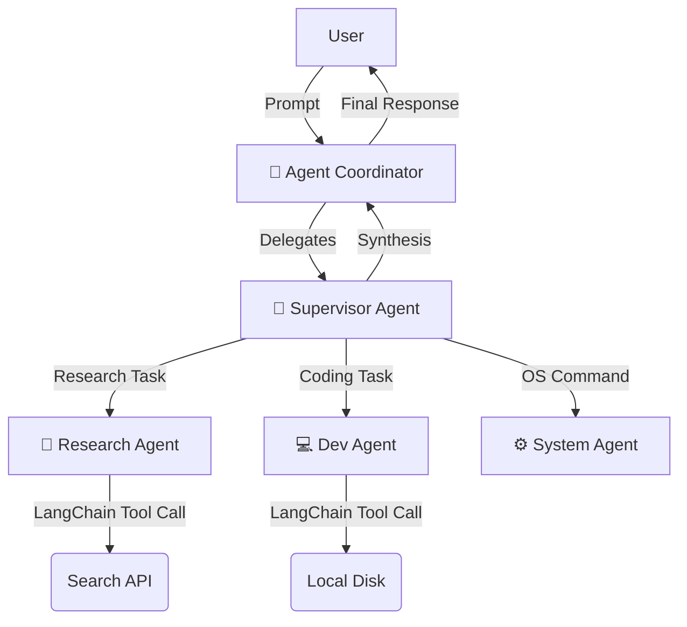

# 🌌 NOVA - Autonomous Multi-Agent System

**NOVA** (Neural Orchestration & Virtual Assistant) is a locally hosted, multi-agent AI system capable of performing complex tasks by coordinating specialized sub-agents. Unlike standard chatbots, NOVA acts as a **Supervisor**, breaking down user intents and delegating work to agents capable of file manipulation, web research, and software development.

> **"An AI that doesn't just talk, but acts."**

---

## 🧠 The Architecture

NOVA follows a **Supervisor-Worker Pattern** built on top of **LangChain**.
* **The Coordinator:** A custom orchestration layer that manages the conversation state and agent delegation.
* **The Agents:** Specialized LangChain agents equipped with custom tools.

---

## 🤖 The Agent Squad
* **Supervisor:** The brain. Maintains context, plans task execution, and critiques the output of other agents.

* **Research Agent:** Equipped with web search tools to gather real-time information and summarize documentation.

* **Dev Agent:** Can write, debug, and save code files to the local disk.

* **System Agent:** interacting with the operating system to manage directories, open applications, and execute shell commands.

---

## 🛠️ Tech Stack

| Core | Python 3.12.3 |
| :--- | :--- |
| **Framework:** | LangChain (Agents & Tooling) |

| **LLM Provider:** | Google Gemini API (via google-generativeai) |

| **Memory:** | SQLite (Conversational persistence & Context recall) |

| **Orchestration:** | Custom Coordinator class wrapping LangChain Agents. |

---

## 📂 Project Structure

NOVA/
├── agents/                 # The specialized agents
│   ├── supervisor/         # Logic for routing and synthesis
│   ├── dev_agent/          # Code generation tools
│   ├── research_agent/     # Web search integration
│   └── system_agent/       # OS interaction tools
├── core/                   # The engine room
│   ├── base_agent.py       # LangChain wrapper (create_tool_calling_agent)
│   ├── coordinator.py      # Manages agent-to-agent message passing
│   ├── memory_manager.py   # SQLite wrapper for long-term memory
│   └── api_manager.py      # Handles LLM API calls and token limits
├── main.py                 # Application entry point
└── nova_memory.db          # Local persistent storage

---

## 🚧 Challenges & Roadmap
* **API Cost Optimization:** Currently refactoring the api_manager.py to minimize token usage during multi-step reasoning chains.

* **Context Window Management:** Implementing a sliding window memory in memory_manager.py to handle long-running sessions without hitting LLM limits.

* **Local LLM Support:** Future plans to integrate Ollama to run NOVA entirely offline using Llama 3.

---

## 📬 Contact

* **Portfolio** - https://udayveer.netlify.app/
* **LinkedIn** - https://www.linkedin.com/in/udayveer-singh-11790a281/
